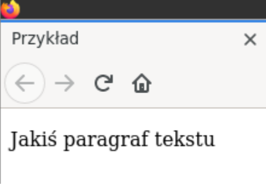
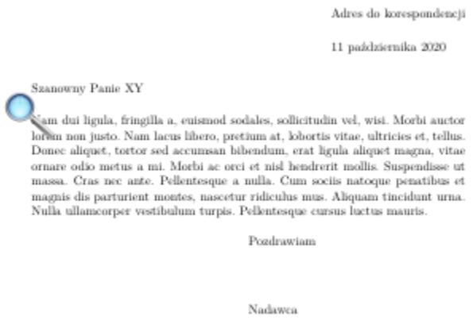
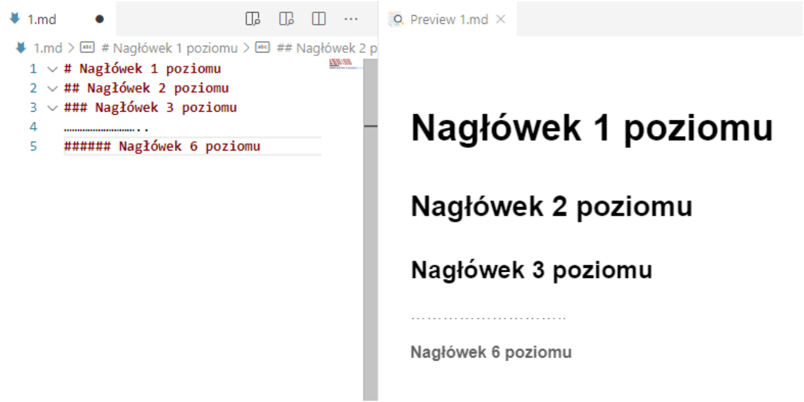
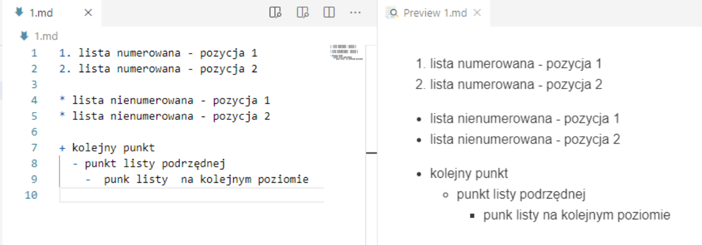
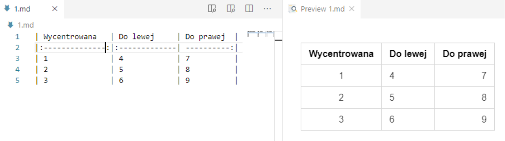
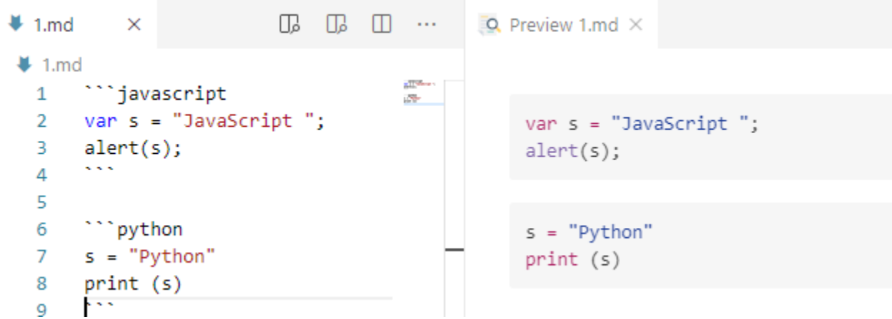
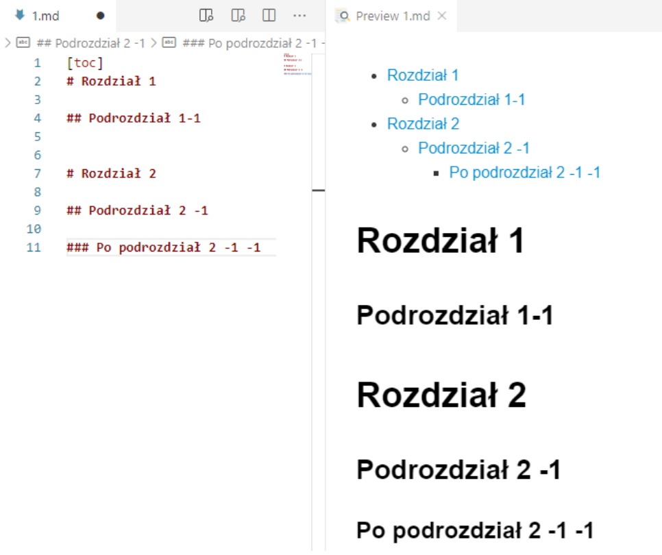
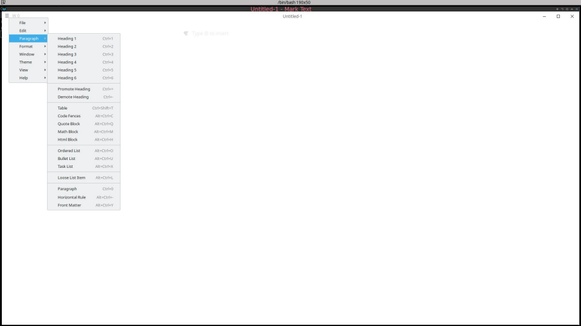
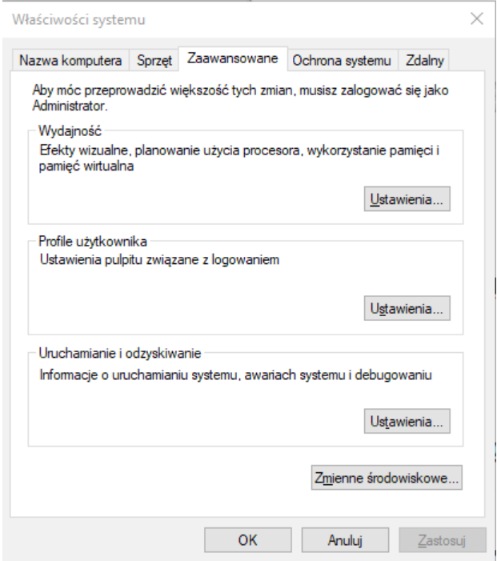
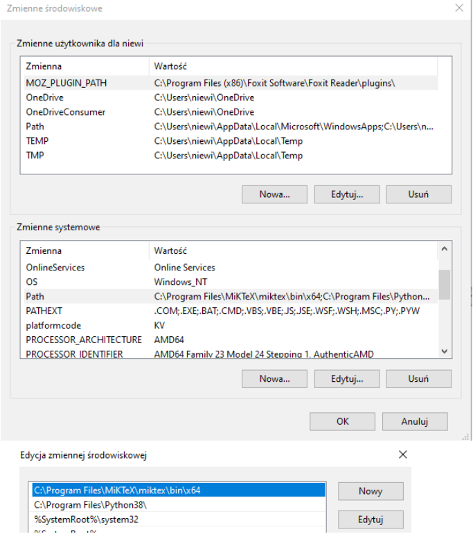

# Lekcja 1 - Markdown lekki język znaczników

## Spis treści

## Wstęp
Obecnie powszechnie wykorzystuje się języki ze znacznikami do opisania dodatkowych informacji
umieszczanych w plikach tekstowych. Z pośród najbardziej popularnych można wspomnieć o:
1. **html** - służącym do opisu struktury infomacji zawartych na stronach internetowych,
2. **Tex** (Latex) - poznany na zajęciach język do "profesjonalnego" składania tekstów,
3. **XML** (*Extensible Markup Language*) - uniwersalnym języku znaczników przeznaczonym do reprezentowania różnych danych w ustrukturalizowany sposób.

Przykład kodu *html* i jego interpretacja w przeglądarce:
```html
<!DOCTYPE html>
<html>
<head>
<meta charset="utf-8"/>
<title>Przykład</Title>
</head>
<body>
<p>Jakiś paragraf tekstu</p>
</body>
</html>
```


Przykład kodu *Latex* i wygenerowanego pliku w formacie *pdf*:
```Latex
\documentclass[]{letter}
\usepackage{lipsum}
\usepackage{polyglossia}
\setmainlanguage{polish}
\begin{document}
\begin{letter}{Szanowny Panie XY}
\opening{}
\lipsum[2]
\signature{Nadawca}
\closing{Pozdrawiam}
\end{letter}
\end{document}
```


Przykład kodu *XML* - fragment dokumentu *SVG (Scalar Vector Graphics)*:
```XML
<!DOCTYPE html>
<html>
<body>
<svg height="100" width="100">
 <circle cx="50" cy="50" r="40" stroke="black" stroke-width="3" fill="red" />
</svg>
</body>
</html>
```


W tym przypadku mamy np. znacznik np. <circle> opisujący parametry koła i który moze być właściwie zinterpretowany przez dedykowaną aplikację (np. przeglądarki www).

Jako ciekawostkę można podać fakt, że również pakiet MS Office wykorzystuje format XML do przechowywania informacji o dodatkowych parametrach formatowania danych. Na przykład pliki z rozszerzeniem *docx*, to nic innego spakowane algorytmem zip katalogi z plikami xml.

Przykład rozpakowania zawartości pliku *test.docx* poleceniem: **unzip**\
$unzip -1 test.docx\
Archive: test.docx\
|Length|Date|Time|Name|
|---|---|---|---|
|573|2022-03-20|08:55|_rels/.rels|
|731|2022-03-20|08:55|docProps/core.xml|
|508|2022-03-20|08:55|docProps/app.xml|
|531|2022-03-20|08:55|word/_rels/document.xml.rels|
|1288|2022-03-20|08:55|word/documents.xml|
|2429|2022-03-20|08:55|word/styles.xml|
|853|2022-03-20|08:55|word/fontTable.xml|
|257|2022-03-20|08:55|word/settings.xml|
|1374|2022-03-20|08:55|[Content_Types].xml|

Wszystkie te języki znaczników cechują się rozbudowaną i złożoną składnią i dlatego do ich edycji wymagają najczęściej dedykowanych narzędzi w postaci specjalizowanych edytorów. By wyeliminować powyższą niedogodność powstał Markdown - uproszczony język znaczników służący do formatowania dokumentów tekstowych (bez konieczności używania specjalizowanych narzędzi). Dokumenty w tym formacie można bardzo łatwo konwertować do wielu innych formatów: np. html, pdf, ps (postscript), epub, xml i wiele innych. Format ten jest powszechnie używany do tworzenia plików README.md (w projektach open source) i powszechnie obsługiwany przez serwery git'a. Język ten został stworzony w 2004 r. a jego twórcami byli John Gruber i Aaron Swartz. W kolejnych latach podjęto prace w ceu stworzenia rozwiązania i tak w 2016 r. opublikowano dokument <ins>RFC 7764</ins> który zawiera opis kilku odmian tegoż języka:

* CommonMark,

* GitHub Flavored Markdown (GFM)

* Markdown Extra

## Podstawy składni
Podany link: [https://github.com/adam-p/markdown-here/wiki/Markdown-Cheatsheet] zawiera opis podstawowych elementów składni w języku angielskim. Poniżej zostanie przedstawiony ich krótki opis w języku polskim.
### Definiowanie nagłówków
W tym celu używamy znaku kratki

Lewe okno zawiera kod źródłowy - prawe - podgląd przetworzonego tekstu



### Definiowanie list



Listy numerowane definiujemy wstawiając numery kolejnych pozycji zakończone kropką. Listy numerowane definiujemy znakami: *,+,-

### Wyróżnianie tekstu


### Tabele



Centrowanie zawartości kolumn realizowane jest poprzez odpowiednie użycie znaku dwukropka:

### Odnośniki do zasobów
\[odnośnik do zasobów](www.gazeta.pl)

\[odnośnik do pliku](LICENSE.md)

\[odnośnik do kolejnego zasobu][1]

\[1]:http://google.com

#### Obrazki
![alt text]\(https:server.com/images/icon48.png "Logo 1") - obrazek z zasobów internetowych

![logo.png] - obraz z lokalnych zasobów

#### Kod źródłowy dla różnych języków programowania



#### Tworzenie spisu treści na podstawie nagłówków



## Edytory dedykowane

Pracę nad dokumentami w formacie Markdown (rozszerzenie .md) można wykonywać w dowolnym edytorze tekstowym. Aczkolwiek istnieje wiele dedykowanych narzędzi

1. marktext - [https://github.com/marktext/marktext]

2. [https://hackmd.io/] online editor

3. Visual Studio Code z wtyczką "markdown preview"



## Pandoc - system do konwersji dokumentów Markdown do innych formatów

Jest to oprogramowanie typu open source służące do konwertowania dokumentów pomiędzy różnymi formatami.

Pod poniższym linkiem można obejrzeć przykłady użycia:

[https://pandoc.org/demos.html]

Oprogramowanie to można pobrać spod adresu: [https://pandoc.org/installing.html]

Jeżeli chcemy konwertować do formatu latex i pdf trzeba doinstalować oprogramowanie składu Latex (np. Na windows najlepiej sprawdzi się Miktex [https://miktex.org])

Gdyby podczas konwersji do formatu pdf pojawił się komunikat o niemożliwości znalezienia programu pdflatex rozwiązaniem jest wskazanie w zmiennej środowiskowej PATH miejsca jego położenia





Pod adresem ([https://gitlab.com/mniewins66/templtemn.git]) znajduje się przykładowy plik markdown z którego można wygenerować prezentację w formacie pdf wykorzystując klasę latexa beamer.

W tym celu należy wydać polecenie z poziomu terminala:

$pandoc templateMN.md -t beamer -o prezentacja.pdf